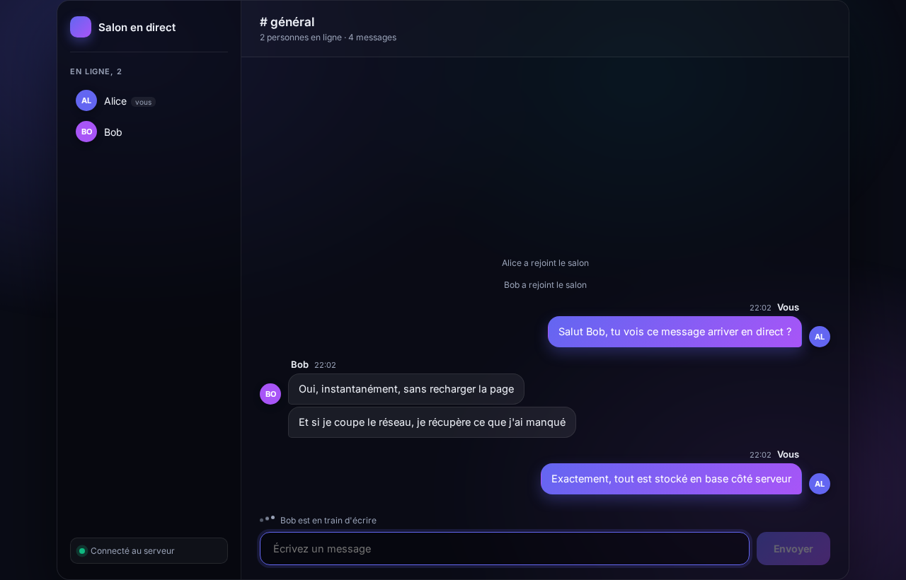

# Real-Time Chat Application

A chat room where messages appear on every screen the moment they are sent, with
no page reload. Node.js and Express on the server, React on the client, and a
WebSocket connection carrying the messages between the two.

## Stack

| Layer         | Choice                | Why                                                   |
| ------------- | --------------------- | ----------------------------------------------------- |
| HTTP server   | Node.js, Express      | Serves the built React app and a small REST endpoint  |
| Real time     | Socket.io (WebSocket) | The server pushes to the browser, not the other way   |
| Interface     | React 18, Vite        | Components and hooks, built by Vite                   |
| Storage       | SQLite (`node:sqlite`)| Built into Node since v22: no database to install     |

## Features

- Live messaging in a shared room
- List of connected people, updated on join and on leave
- "Someone is typing" indicator
- History kept in SQLite, so nothing is lost on refresh or on server restart
- Replay on reconnection: a client that drops receives exactly the messages it
  missed, no duplicates

## Requirements

Node.js 22.5 or newer (the built-in `node:sqlite` module arrived in that
version). Check with `node -v`.

## Install

    npm run setup

This installs the server dependencies and the client ones.

## Run

**Development**, with instant reload on every change. Two terminals:

    npm run dev      # Node server, port 3000
    npm run client   # React dev server, port 5173

Then open http://localhost:5173

**Production**, one single server:

    npm run build    # compiles React into client/dist
    npm start        # Express serves it, port 3000

Then open http://localhost:3000

Open the address in two browser tabs, pick a different name in each, and the
messages appear on both sides at once.

To start a demo from an empty room:

    npm run reset

## How a message travels

1. React holds what you type in a state variable, and sends the text through the
   socket when you submit the form.
2. The server receives it, writes it to SQLite, and gets back the row with its
   id and its timestamp.
3. The server broadcasts that row to everyone in the room, sender included.
4. Every React client receives it and adds it to its list of messages, which is
   enough for React to redraw the conversation.

Storing before broadcasting is deliberate: if the write fails, nobody is shown a
message that does not exist.

## Replay on reconnection

Each client remembers the id of the last message it received. That id is sent on
every connection attempt, including automatic reconnections, so the server can
answer with everything that came after it. A dropped connection therefore loses
no message and duplicates none.

Arrivals and departures are the exception: they travel on a separate `notice`
channel and are never stored, so the history stays a history of what people
actually said.

## Project layout

    server/
      index.js      the whole backend: Express, Socket.io, SQLite
      reset.js      empties the history before a demo
    client/
      src/
        App.jsx           picks between the join screen and the chat room
        hooks/useChat.js  the socket connection, isolated in a custom hook
        components/       JoinScreen, ChatRoom, MessageList, Message,
                          UserList, TypingIndicator, Composer
        styles.css        the interface, plain CSS
    legacy/           the first version of this project, kept for reference

## Scope

This is a demonstration application. There is no account and no password: a
visitor picks a display name and joins. Adding real accounts would mean server
side sessions, which is out of scope here.

The earlier version of the project, written before this rewrite, is kept under
`legacy/`. It carried a login form and its own security notes.
